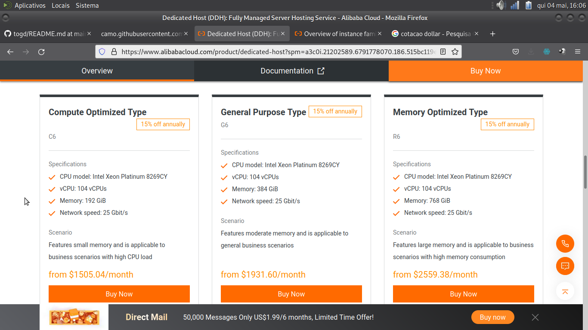

# togd
interface for docker using php apache very simple

# O que falta

Fazer build de uma imagem com ssh e todos os parâmetros necessários. É um código simples somente para dois containers, falta ajustar portas
no código pois não é por ip, e ajustar o docker para rede.

## Estudo

Tem ou você sabe, procure no yotube sobre os players de cloud iaas, como funciona o container.... 

## Preços

china [alibaba](https://www.alibabacloud.com/product/dedicated-host?spm=a3c0i.21202589.6791778070.186.515bc119egRPgj)
384GB = R$9640  $1932X 4,99

imagina containers = 1 GB 

fazendo 300 x$ 50 = 15000

terceirizar a infraestrutura.

